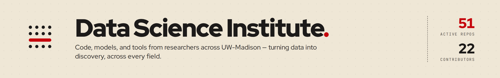

  

  <a href="https://dsi.wisc.edu/">Website</a> &bull;
  <a href="https://dsi.wisc.edu/services/data-science-services/">Services</a> &bull;
  <a href="https://dsi.wisc.edu/services/gpu/">Computing Resources</a> &bull;
  <a href="mailto:research@datascience.wisc.edu">Contact Us</a>

---

## About

The **Data Science Institute (DSI)**, powered by American Family Insurance, is central to UW-Madison's strategic priority to grow its research enterprise and expand its global impact. We pair campus researchers with data scientists and research software engineers to develop customized solutions that extract value from data and open new research directions.

## What We Do

**Data Science Services** - We collaborate with researchers across campus on applied data science problems, from exploratory prototyping to production-grade tools. Engagements range from fee-for-service agreements to grant-funded partnerships, and we offer pre-award assistance to strengthen competitive proposals.

**Computing Resources** - We provide GPU and high-performance computing infrastructure for computationally intensive research workloads.

**Open Source Program Office (OSPO)** - We support and advocate for open-source development practices across campus, tracking contributions and building community around shared research software.

**Training and Community** - We host workshops, seminars, and Data Carpentry courses, and we coordinate campus-wide initiatives like [RISE-AI Collaboration HQ](https://dsi.wisc.edu/) to foster AI research communities and improve funding opportunities.

## Research Areas

Our projects span a wide range of domains, reflecting the breadth of data-driven research at UW-Madison:

| Domain | Examples |
| --- | --- |
| **Agriculture and Plant Science** | Crop disease forecasting, fungicide efficacy meta-analysis, soil health and carbon modeling, soybean breeding trials |
| **Public Health and Epidemiology** | COVID-19 wastewater surveillance, mosquito observation dashboards, pregnancy wellbeing tracking |
| **AI and Machine Learning** | Semantic expert search, anomaly detection, phoneme classification, synthetic protein generation |
| **Geospatial and Environmental** | Weather APIs, campus and community mapping tools, sustainability planning (SDG360) |
| **Research Infrastructure** | Faculty search tools, research dashboards, knowledge graphs, HPC environment tooling |
| **Open Source and Community** | OSPO survey analysis, contribution tracking, open-source exploration, reproducible research |

## Getting Started

- **Researchers**: [Schedule a consultation](https://dsi.wisc.edu/services/data-science-services/) to explore how DSI can support your work, whether through collaborative analysis, research software engineering, or grant partnership.
- **Industry and Community Partners**: We facilitate connections between external partners and campus data scientists, and pursue public-private funding opportunities including SBIR/STTR grants.
- **Contributors**: Browse our repositories below and check individual project READMEs for contribution guidelines.

<!-- ACTIVE_REPOS:START -->
<!-- ACTIVE_REPOS:END -->

## Connect

| | |
| --- | --- |
| Web | [dsi.wisc.edu](https://dsi.wisc.edu/) |
| Email | [research@datascience.wisc.edu](mailto:research@datascience.wisc.edu) |
| Address | 1205 University Ave, Madison, WI 53706 |
| OSPO | [ospo.wisc.edu](https://ospo.wisc.edu/) |
